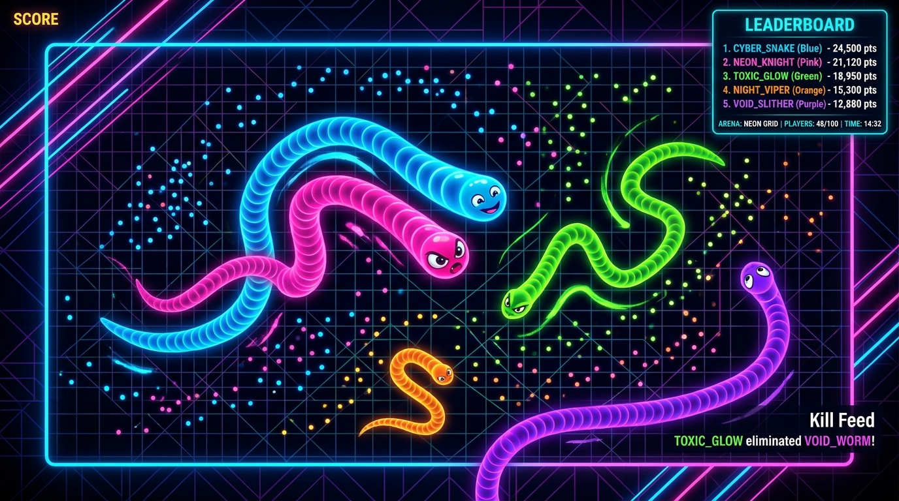
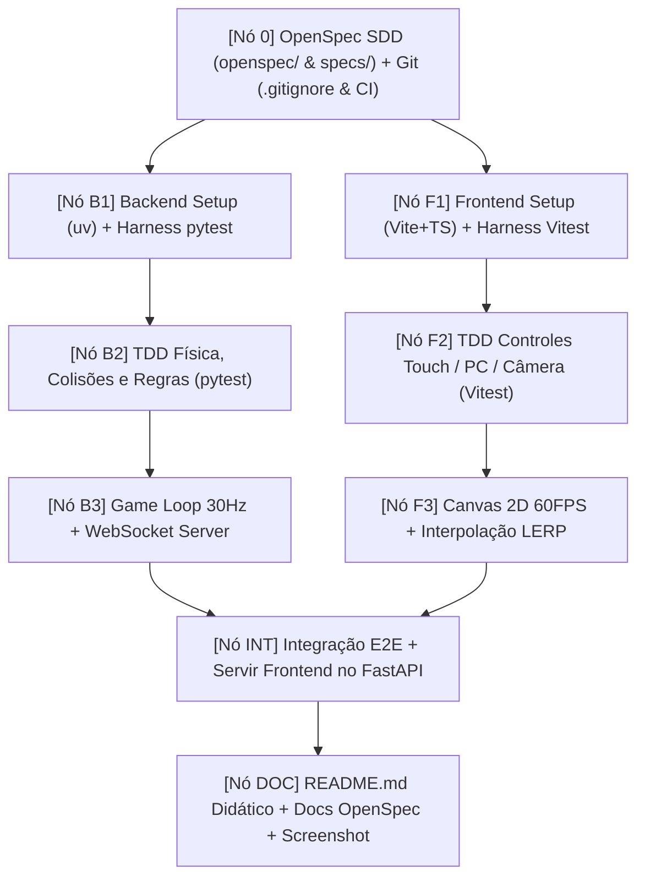

# 🐍 Snake Battle Royale Multiplayer

[](file:///.github/workflows/ci.yml)
[](file:///home/douglas/Workspace/claude/snake-game/openspec/)
[](file:///home/douglas/Workspace/claude/snake-game/pyproject.toml)
[](file:///home/douglas/Workspace/claude/snake-game/server/)
[](file:///home/douglas/Workspace/claude/snake-game/client/)
[](file:///home/douglas/Workspace/claude/snake-game/client/)
[](file:///home/douglas/Workspace/claude/snake-game/docs/TEST_HARNESS.md)

Um jogo **Multiplayer Online em Tempo Real: Snake Battle Royale** (estilo *Slither.io / Curve Fever*), moderno, responsivo e construído com **Spec-Driven Development (SDD)** no padrão **OpenSpec** e **Graph Engineering (DAG)**.

---



---

## ⚡ 1. Início Rápido (Execução com 1 Comando)

O backend FastAPI serve a API, os WebSockets e a interface web compilada (`client/dist`) de forma unificada:

```bash
# 1. Instalar dependências e compilar
uv sync
cd client && npm install && npm run build && cd ..

# 2. Executar o jogo completo com 1 comando
uv run uvicorn server.app.main:app --host 0.0.0.0 --port 8000
```

Abra seu navegador em: **[http://localhost:8000](http://localhost:8000)**

---

## 🎮 2. Controles Multiplataforma

| Plataforma | Direção & Movimento | Turbo / Aceleração |
| :--- | :--- | :--- |
| **PC (Desktop)** | **Cursor do Mouse** (aponta e segue) ou **Teclas WASD / Setas** | **Barra de Espaço** ou **Clique Esquerdo do Mouse** |
| **Mobile / Tablet** | **Joystick Virtual Flutuante** (toque e arraste em qualquer lugar da tela) | **Botão Turbo Dedicado** (canto inferior direito com suporte a multi-touch) |

---

## 🛠️ 3. Modo de Desenvolvimento (Live Reload)

Para trabalhar com hot-reload no frontend e backend simultaneamente:

```bash
# Terminal 1: Backend FastAPI com auto-reload
uv run uvicorn server.app.main:app --reload --port 8000

# Terminal 2: Frontend Vite com HMR
cd client && npm run dev
```

Acesse o cliente Vite em `http://localhost:3000` (conecta automaticamente ao backend na porta `8000`).

---

## 🧪 4. Suíte de Testes & Test Harness (< 2s)

O projeto possui um **Test Harness Determinístico** com relógio virtual e zero bloqueios de tempo real (`sleep`):

```bash
# Executar testes do Backend (28 testes em ~0.3s)
uv run pytest

# Executar testes do Frontend (13 testes em ~0.4s)
cd client && npm test
```

Para mais detalhes sobre a arquitetura dos testes, consulte: [`docs/TEST_HARNESS.md`](file:///home/douglas/Workspace/claude/snake-game/docs/TEST_HARNESS.md).

---

## 📜 5. Spec-Driven Development (SDD) com OpenSpec

Todas as funcionalidades foram formalmente especificadas antes da escrita do código de produção, seguindo o padrão **[OpenSpec](file:///home/douglas/Workspace/claude/snake-game/openspec/)**:

- [`openspec/config.yaml`](file:///home/douglas/Workspace/claude/snake-game/openspec/config.yaml): Configuração do ecossistema OpenSpec.
- [`openspec/specs/protocol/spec.md`](file:///home/douglas/Workspace/claude/snake-game/openspec/specs/protocol/spec.md): JSON Schemas de todas as mensagens WebSocket.
- [`openspec/specs/physics/spec.md`](file:///home/douglas/Workspace/claude/snake-game/openspec/specs/physics/spec.md): Equações de movimento, turn rate, spatial hash e colisões.
- [`openspec/specs/lifecycle/spec.md`](file:///home/douglas/Workspace/claude/snake-game/openspec/specs/lifecycle/spec.md): Máquina de Estados Finita (FSM) do Jogador e da Sala.
- [`openspec/specs/harness/spec.md`](file:///home/douglas/Workspace/claude/snake-game/openspec/specs/harness/spec.md): Invariantes do Test Harness.
- [`docs/SPEC_DRIVEN_DEVELOPMENT.md`](file:///home/douglas/Workspace/claude/snake-game/docs/SPEC_DRIVEN_DEVELOPMENT.md): Guia prático da metodologia SDD.

---

## 🏗️ 6. Arquitetura e Grafo DAG



---

## 📁 7. Estrutura do Repositório

```text
snake-royale/
├── .github/
│   └── workflows/
│       └── ci.yml                   # CI automatizado (uv pytest + npm test)
├── .gitignore
├── pyproject.toml                   # Dependências Python gerenciadas pelo uv
├── README.md                        # Documentação didática com screenshot
├── assets/
│   └── game_preview.png             # Preview da arena do jogo
├── openspec/                        # Especificações formais OpenSpec
│   ├── config.yaml
│   ├── specs/                       # Source of Truth por domínio
│   └── changes/v1.0.0-viper/        # Proposta ativa (proposal, design, tasks, deltas)
├── specs/                           # Bridges de compatibilidade v1.0.0-VIPER
├── docs/
│   ├── SPEC_DRIVEN_DEVELOPMENT.md   # Guia didático do OpenSpec SDD
│   └── TEST_HARNESS.md              # Guia do Test Harness e relógio virtual
├── server/                          # Backend Python (FastAPI + Game Engine)
│   ├── app/
│   │   ├── main.py                  # Entrypoint FastAPI e rotas estáticas
│   │   ├── websocket_handler.py     # Gerenciador WebSocket e eventos
│   │   └── game/                    # Engine, física, spatial hash e loop
│   └── tests/
│       ├── conftest.py
│       ├── harness/                 # Virtual clock, validator e mocks
│       └── test_*.py                # Suíte de testes unitários e E2E
└── client/                          # Frontend TypeScript + Canvas 2D
    ├── package.json
    ├── vite.config.ts
    ├── vitest.config.ts
    ├── index.html
    ├── src/
    │   ├── main.ts                  # Game loop e inicialização
    │   ├── index.css                # Design system responsivo
    │   ├── input/                   # Controles Desktop e Joystick Virtual
    │   ├── render/                  # Canvas 2D Renderer e Câmera Retina
    │   ├── net/                     # WebSocket Client e Interpolador LERP
    │   └── ui/                      # HUD, Leaderboard e Modais
    └── tests/
        ├── harness/                 # Canvas mock, touch simulator, packet generator
        └── *.test.ts                # Suíte de testes vitest
```
