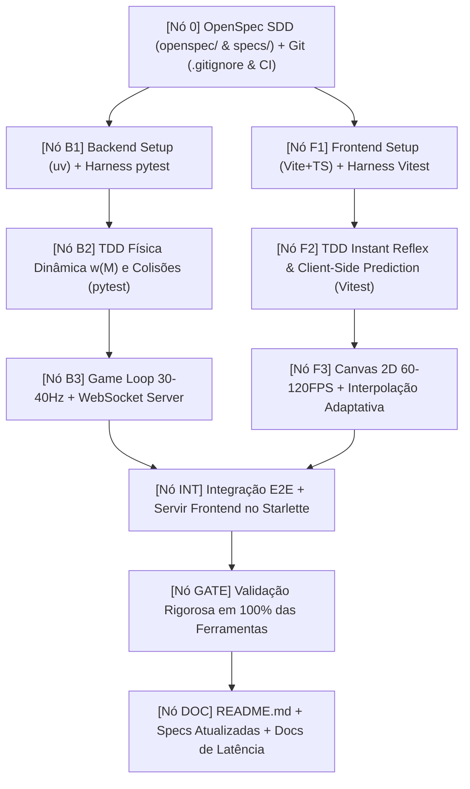

# 🐍 Snake Battle Royale Multiplayer

[](file:///.github/workflows/ci.yml)
[](file:///home/douglas/Workspace/claude/snake-game/openspec/)
[](file:///home/douglas/Workspace/claude/snake-game/pyproject.toml)
[](file:///home/douglas/Workspace/claude/snake-game/server/)
[](file:///home/douglas/Workspace/claude/snake-game/client/)
[](file:///home/douglas/Workspace/claude/snake-game/client/)
[](file:///home/douglas/Workspace/claude/snake-game/docs/TEST_HARNESS.md)

Um jogo **Multiplayer Online em Tempo Real: Snake Battle Royale** (estilo *Slither.io / Curve Fever*), moderno, com **HUD Ergonômico de 3 Cantos**, **Reflex Engine (<16ms CSP)**, gesto universal **Double-Tap & Hold para Turbo**, **12+ Skins com Padrões Misturados**, **Interpolação Anti-Tremor**, **Física de Contato Puro sem Auto-Colisão** e **Diretrizes de Eficiência de Tokens**, construído sob **Spec-Driven Development (SDD)** no padrão **OpenSpec** e **Graph Engineering (DAG)**.

---


---

## ⚡ 1. Início Rápido (Execução com 1 Comando)

O backend Starlette serve a API, os WebSockets e a interface web compilada (`client/dist`) de forma unificada:

```bash
# 1. Instalar dependências e compilar
uv sync
cd client && npm install && npm run build && cd ..

# 2. Executar o jogo completo com 1 comando
uv run uvicorn server.app.main:app --host 0.0.0.0 --port 8000
# ou simplesmente:
npm start
```

Abra seu navegador em: **[http://localhost:8000](http://localhost:8000)**

---

## 🏎️ 2. Motor de Precisão & Novidades (v1.4.0-HUD-LAYOUT)

### 📊 HUD Ergonômico Triádico (Desktop & Mobile)
- **Quina Superior Direita:** Top 10 Ranking (`🏆 TOP VIPERS`) com destaque ciano para o jogador local.
- **Quina Inferior Esquerda:** Telemetria vital compacta com 2 métricas essenciais (`SCORE` e `RANK`).
- **Quina Inferior Direita:** Radar / Minimapa Canvas 2D em tempo real com mira interna e blips de adversários em magenta.
- **Double-Tap & Hold:** Dê 2 toques rápidos na tela ou no joystick e segure o segundo toque para ativar o Turbo. Ao soltar o dedo, o turbo desliga instantaneamente.
- **Tela 100% Desobstruída:** Removeu-se o botão fixo flutuante que ficava em cima do minimap no celular vertical ou sumia no tablet.

### 🎨 12+ Skins Vibrantes com Cores Misturadas (10+ Jogadores)
- Suporte para mais de 10 jogadores na mesma arena com ampla variedade visual: `Neon Cyan`, `Cyber Magenta`, `Toxic Lime`, `Solar Flare`, `Hyper Rainbow`, `Galaxy Void`, `Sunset Vapor`, `Lava Magma`, `Ice Frost`, `Toxic Hazard`, `Bubblegum` e `Matrix Code`.
- Segmentos bicolores alternados, gradientes cósmicos, listras de alerta e ciclo dinâmico arco-íris.

### 🎯 Física de Contato Puro (Zero Mortes Fantasmas)
- **Sem Auto-Colisão:** A cobra nunca morre ao encostar em seu próprio corpo em curvas fechadas.
- **Contato Físico Rigoroso:** Eliminações ocorrem estritamente na sobreposição real entre a cabeça e segmentos de cobras adversárias ou a borda da arena, com partículas de explosão no ponto exato do impacto.

### 🧈 Movimento Fluido sem Tremor (Anti-Jitter)
- Sincronização de relógio baseada em timestamp local de chegada no cliente, garantindo LERP contínuo a 60–120 FPS nas cobras inimigas.

---

## 🎮 3. Controles Multiplataforma

| Plataforma | Direção & Movimento | Turbo / Aceleração |
| :--- | :--- | :--- |
| **PC (Desktop)** | **Cursor do Mouse** (aponta e segue) ou **Teclas WASD / Setas** | **Barra de Espaço** ou **Clique Esquerdo Segurado** (com $M > 3.0$) |
| **Mobile / Tablet** | **Toque e Arraste** em qualquer ponto da tela | **Double-Tap & Hold** (2 toques segurando o 2º) ou **Toque com 2º Dedo** |

---

## 🛠️ 4. Modo de Desenvolvimento (Live Reload)

Para trabalhar com hot-reload no frontend e backend simultaneamente:

```bash
# Terminal 1: Backend Starlette com auto-reload
npm run dev

# Terminal 2: Frontend Vite com HMR
cd client && npm run dev
```

Acesse o cliente Vite em `http://localhost:3000` (conecta automaticamente ao backend na porta `8000`).

---

## 🧪 5. Suíte de Testes, Quality Gates & OpenSpec CLI

O projeto possui um **Test Harness Determinístico** com relógio virtual e zero bloqueios de tempo real (`sleep`):

```bash
# Executar todos os testes e validação de especificações
npm test

# Linter PEP 8 e checagem estática de tipos do Backend
npm run lint

# Validação e integridade de especificações OpenSpec
npm run spec:validate
npm run spec:doctor
```

Para mais detalhes sobre a arquitetura dos testes, consulte: [`docs/TEST_HARNESS.md`](file:///home/douglas/Workspace/claude/snake-game/docs/TEST_HARNESS.md).

---

## 📜 6. Spec-Driven Development (SDD) com OpenSpec

Todas as funcionalidades são formalmente especificadas antes da escrita de código de produção, no padrão **[OpenSpec](file:///home/douglas/Workspace/claude/snake-game/openspec/)**:

- [`openspec/config.yaml`](file:///home/douglas/Workspace/claude/snake-game/openspec/config.yaml): Configuração do ecossistema OpenSpec.
- [`openspec/specs/protocol/spec.md`](file:///home/douglas/Workspace/claude/snake-game/openspec/specs/protocol/spec.md): JSON Schemas de todas as mensagens WebSocket.
- [`openspec/specs/physics/spec.md`](file:///home/douglas/Workspace/claude/snake-game/openspec/specs/physics/spec.md): Equações de movimento, dinâmica $\omega(M)$ e colisões.
- [`openspec/specs/lifecycle/spec.md`](file:///home/douglas/Workspace/claude/snake-game/openspec/specs/lifecycle/spec.md): Máquina de Estados Finita (FSM) do Jogador e da Sala.
- [`openspec/specs/hud/spec.md`](file:///home/douglas/Workspace/claude/snake-game/openspec/specs/hud/spec.md): Layout ergonômico em 3 cantos, métricas vitais e radar.
- [`openspec/specs/rendering/spec.md`](file:///home/douglas/Workspace/claude/snake-game/openspec/specs/rendering/spec.md): Screen-Space integer pixel alignment e skins.
- [`openspec/specs/harness/spec.md`](file:///home/douglas/Workspace/claude/snake-game/openspec/specs/harness/spec.md): Invariantes do Test Harness determinístico.
- [`docs/SPEC_DRIVEN_DEVELOPMENT.md`](file:///home/douglas/Workspace/claude/snake-game/docs/SPEC_DRIVEN_DEVELOPMENT.md): Guia prático da metodologia SDD e comandos OpenSpec.
- [`docs/LATENCY_AND_COMMAND_TUNING.md`](file:///home/douglas/Workspace/claude/snake-game/docs/LATENCY_AND_COMMAND_TUNING.md): Guia do motor de baixa latência e CSP.

### 🤖 Comandos para Agentes de IA (Slash Commands & Workflows)

Disponíveis tanto no **Google Antigravity** (via [`.agent/`](file:///home/douglas/Workspace/claude/snake-game/.agent/)) quanto no **Claude Code** (via [`.claude/`](file:///home/douglas/Workspace/claude/snake-game/.claude/)):

- `/opsx-propose "descrição"`: Criar nova proposta de especificação.
- `/opsx-apply "change-id"`: Implementar mudança orientada por TDD e DAG.
- `/opsx-update "change-id"`: Revisar os artefatos de planejamento de uma change.
- `/opsx-sync`: Sincronizar especificações com o código-fonte.
- `/opsx-archive "change-id"`: Arquivar e promover especificação ratificada.
- `/opsx-explore "tópico"`: Investigar arquitetura ou alinhar ideias.

Instruções de projeto por agente: [`GEMINI.md`](file:///home/douglas/Workspace/claude/snake-game/GEMINI.md) (Antigravity) e [`CLAUDE.md`](file:///home/douglas/Workspace/claude/snake-game/CLAUDE.md) (Claude Code).

---

## 🏗️ 7. Arquitetura e Grafo DAG



---

## 📱 8. Release do APK Android (assinatura)

O APK publicado nas *GitHub Releases* é um build **de release assinado**. Um build de
debug não é distribuível: o Android 13 recusa o sideload de pacotes `debuggable`
assinados por chave desconhecida, e a chave efêmera do runner tornaria toda
atualização incompatível (`INSTALL_FAILED_UPDATE_INCOMPATIBLE`). Ver `REQ-AND-009`.

### Gerar a keystore (uma única vez)

```bash
keytool -genkeypair -v -keystore snake-royale-release.jks \
  -keyalg RSA -keysize 4096 -validity 10000 -alias snake-royale

base64 -w0 snake-royale-release.jks   # conteúdo do secret ANDROID_KEYSTORE_BASE64
```

> ⚠️ **Faça backup da keystore fora do repositório.** Perdê-la impede publicar
> qualquer atualização instalável sobre uma versão já instalada — os usuários
> precisariam desinstalar o app e perder os dados locais. O arquivo é bloqueado por
> `.gitignore` (`*.jks`, `*.keystore`, `android/keystore.properties`).

### Secrets necessários

Em *Settings → Secrets and variables → Actions*:

| Secret | Conteúdo |
| :--- | :--- |
| `ANDROID_KEYSTORE_BASE64` | keystore `.jks` codificada em base64 |
| `ANDROID_KEYSTORE_PASSWORD` | senha do keystore |
| `ANDROID_KEY_ALIAS` | alias da chave (`snake-royale`) |
| `ANDROID_KEY_PASSWORD` | senha da chave |

### Build local assinado (opcional)

Crie `android/keystore.properties` (não versionado):

```properties
storeFile=/caminho/absoluto/snake-royale-release.jks
storePassword=...
keyAlias=snake-royale
keyPassword=...
```

Sem esse arquivo e sem as variáveis de ambiente o projeto continua configurando
normalmente — apenas o `release` sai sem assinatura, e `assembleDebug` segue funcionando.

### Instalar no aparelho (Play Protect)

O APK é distribuído por sideload, fora da Play Store. Na primeira instalação o
Android 13+ mostra **"O app não foi instalado"** sem explicar o motivo: é o Play
Protect recusando um pacote sem reputação no Google. Não é defeito do build — é como
o sideload funciona para qualquer app não publicado.

Para instalar: *Play Store → seu perfil → Play Protect → ⚙️ → desativar "Verificar
apps"*, instale, e **reative em seguida**.

### Conferir um APK baixado

```bash
sha256sum -c snake-royale-server-vX.Y.Z.apk.sha256        # download íntegro?
apksigner verify --print-certs --verbose *.apk            # v2/v3, signer != CN=Android Debug
aapt dump badging *.apk | grep -E "^package:|debuggable"  # sem .debug, sem debuggable
```

---

## 🖥️ 9. Rodando o build desktop

Toda *GitHub Release* também publica um executável desktop single-file (Linux,
Windows e macOS), gerado com [PyInstaller](https://pyinstaller.org/) a partir do
mesmo `server/app/__main__.py` que serve o servidor Starlette/Uvicorn embutido —
sem exigir Node.js, interpretador Python ou qualquer setup manual na máquina do
usuário final. Ver `REQ-DESK-001` / `REQ-DESK-002`.

Ao executar o binário (`snake-royale-desktop-linux`, `snake-royale-desktop-windows.exe`
ou `snake-royale-desktop-macos`):

1. O servidor sobe em `0.0.0.0:8000`, acessível também por outros dispositivos na
   mesma rede local (mesmo esquema de LAN IP do banner do `npm run dev`).
2. Assim que o endpoint `/health` responde com sucesso — via *polling* em
   intervalos curtos, nunca um `sleep` fixo — o navegador padrão do sistema abre
   automaticamente em `http://localhost:8000`.

### Baixando e executando

```bash
# 1. Baixe o executável e o .sha256 correspondentes na página da Release
# 2. Confira a integridade do download
sha256sum -c snake-royale-desktop-linux.sha256   # ou shasum -a 256 -c no macOS

# 3. Torne executável (Linux/macOS) e rode
chmod +x snake-royale-desktop-linux
./snake-royale-desktop-linux
```

### Sem assinatura de código

Os executáveis **não são assinados nem notarizados** — publicar a release não
depende de certificado de code-signing. Isso faz o sistema operacional exibir um
aviso de "aplicativo não confiável" no primeiro uso; não é malware, é apenas a
ausência de assinatura. Contorne com um clique:

- **Windows (SmartScreen):** ao rodar o `.exe`, clique em **"Mais informações"**
  e depois em **"Executar assim mesmo"**.
- **macOS (Gatekeeper):** clique com o botão direito no binário → **"Abrir"** →
  confirme **"Abrir"** na caixa de diálogo. Alternativa via terminal:
  ```bash
  xattr -d com.apple.quarantine snake-royale-desktop-macos
  ```
- **Linux:** nenhum aviso equivalente — apenas garanta a permissão de execução
  (`chmod +x`).
