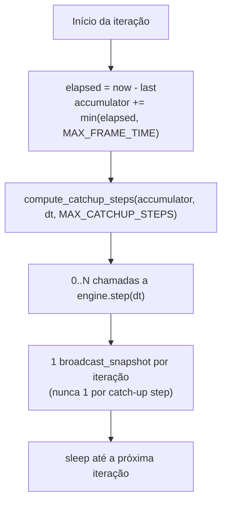

# 🔁 Loop Engineering — Contrato do Game Loop Autoritativo

Este documento detalha o contrato de temporização do loop de jogo servidor-autoritativo do **Snake Battle Royale**, por que ele existe, e um checklist de pré-voo para qualquer mudança futura que toque o timestep. Referência viva: `openspec/specs/loop/spec.md` e `openspec/changes/archive/*-v1-7-1-hotfix-android-loop-sync/` (caso de estudo).

---

## ⚡ 1. O contrato accumulator/catch-up

`server/app/game/loop.py` roda com **timestep fixo** (`dt` derivado da tick rate configurada, 30-40 Hz), nunca com `dt` variável. Isso preserva o determinismo físico: `REQ-PHYS-*` e o spatial-hash de colisão assumem implicitamente que cada `engine.step()` avança sempre pela mesma quantidade de tempo simulado.

O que varia é **quantas vezes** `engine.step(dt)` é chamado por iteração do loop, via um acumulador de tempo real decorrido:

- **`MAX_FRAME_TIME = 0.25s`** — teto do tempo real contabilizado por iteração. Um stall além disso tem o excedente **descartado** (não simulado), não enfileirado.
- **`MAX_CATCHUP_STEPS = 5`** — teto de `engine.step()` consecutivos para consumir o backlog acumulado. Corresponde a ~165ms de catch-up (5 × 33ms) antes de começar a descartar tempo.
- **Um snapshot por iteração**, independentemente de quantos catch-up steps rodaram — evita rajadas de pacotes que por si só pareceriam uma distorção ao cliente.

## 🛡️ 2. Por que existem os dois tetos (proteção contra spiral-of-death)

Catch-up **sem limite** é uma armadilha clássica de game loop: se uma iteração demora mais que `dt` para processar o backlog, a próxima iteração já começa mais atrasada, precisa processar ainda mais backlog, demora mais — um espiral que nunca se recupera. `MAX_CATCHUP_STEPS` garante que, após um stall longo, o tempo não simulado é deliberadamente descartado (perda aceitável e pontual) em vez de perseguido para sempre.

O trade-off inverso — deixar o tempo simulado ficar permanentemente atrás do tempo real sem catch-up algum — é o bug original desta hotfix: `loop.py` antes desta mudança rodava `engine.step()` exatamente uma vez por iteração, sem acumulador, então um tick overrun era simplesmente absorvido rodando a próxima iteração imediatamente, sem compensação.

## 📡 3. Sinal de stall no protocolo e no cliente

`WORLD_SNAPSHOT.tickDurationMs` (`REQ-PROTO-004`) é o campo aditivo/opcional que carrega o tempo real que aquele tick levou para ser produzido. Ele existe para que o cliente diferencie um stall genuíno de jitter de rede comum:

- **Interpolador** (`REQ-PROTO-008`): o buffer de interpolação adaptativo não exclui mais gaps ≥500ms da medição de jitter — um stall agora *alarga* o delay adaptativo (clamp `[35, 120]`ms) em vez de ser invisível a ele. Esgotamento momentâneo do buffer é preenchido por extrapolação (até `MAX_EXTRAPOLATION_MS = 100`) em vez de congelar imediatamente.
- **Predictor local** (`REQ-PROTO-009`): reconciliação com drift acima do limiar continua com hard-snap instantâneo quando o gap **não** foi sinalizado como stall conhecido (comportamento antigo, preservado). Quando o gap **foi** sinalizado, aplica uma correção suavizada (eased) em vez de teleporte.

## 🐍 4. Broadcast concorrente

`ConnectionManager.broadcast_snapshot()` (`REQ-LOOP-003`) despacha os `send_text()` de todos os sockets via `asyncio.gather(..., return_exceptions=True)` em vez de sequencialmente. Um cliente lento não atrasa mais a entrega aos demais, e o custo por tick deixa de crescer linearmente com o número de jogadores conectados.

## ✅ 5. Checklist de pré-voo para mudanças que tocam o timestep

Antes de alterar `loop.py`, `engine.py` (assinatura de `step`/`create_snapshot`), `interpolator.ts` ou `local_predictor.ts`:

1. **O `dt` continua fixo?** Nunca passe um `dt` calculado a partir do tempo decorrido para `engine.step()` — isso quebra o determinismo físico.
2. **Existe um teto explícito para catch-up?** Qualquer acumulador de tempo real precisa de um `MAX_FRAME_TIME`/equivalente — sem isso, um stall gera spiral-of-death.
3. **O broadcast continua 1-por-iteração?** Não é 1-por-`engine.step()`.
4. **`tickDurationMs` continua opcional?** É um campo aditivo — clientes antigos ou que constroem pacotes manualmente em teste devem seguir funcionando sem ele (fallback para heurística de delta de chegada).
5. **O teste cobre o cenário de overrun *e* o cenário normal?** Um teste que só verifica o caminho de catch-up pode esconder uma regressão no caminho comum (ex.: `engine.step` chamado mais de uma vez por iteração quando não há overrun).
6. **Zero-sleep:** qualquer teste de temporização usa `VirtualClock`/mocking de `time.monotonic`, nunca `time.sleep()` — ver `docs/TEST_HARNESS.md`.
7. **A verificação em dispositivo físico é necessária?** O gatilho real (contenção de CPU no Chaquopy/JVM em Android) só reproduz em hardware real — os testes automatizados validam a *lógica* sob overrun/stall simulado, mas não substituem a validação manual em dispositivo (Node VAL) antes de arquivar a change.

## 📚 6. Constantes de referência

| Constante | Valor | Local | Papel |
| :--- | :--- | :--- | :--- |
| `MAX_FRAME_TIME` | `0.25s` | `server/app/game/loop.py` | Teto de tempo real acumulado por iteração |
| `MAX_CATCHUP_STEPS` | `5` | `server/app/game/loop.py` | Teto de `engine.step()` consecutivos por iteração |
| Clamp do delay adaptativo | `[35, 120]`ms | `client/src/net/interpolator.ts` | Faixa do delay de interpolação adaptativo |
| `STALL_THRESHOLD_MS` | `200`ms | `client/src/net/interpolator.ts` | Limiar para setar o delay direto em 120ms e suspender a EMA |
| `MAX_EXTRAPOLATION_MS` | `100`ms | `client/src/net/interpolator.ts` | Teto de extrapolação por velocidade antes de congelar no último frame |
| Limiar de hard-snap | `180px` | `client/src/net/local_predictor.ts` | Drift acima do qual a reconciliação corrige a posição |

Essas constantes são estimativas conservadoras validadas por teste automatizado, não por medição em hardware Android real — a validação em dispositivo (Node VAL desta change) é o gate de aceitação da hipótese, e é onde retuná-las se necessário.
