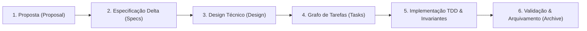

# 📐 Spec-Driven Development (SDD) com OpenSpec

Este documento apresenta a metodologia de **Spec-Driven Development (SDD)** aplicada no desenvolvimento do **Snake Battle Royale Multiplayer**, utilizando o padrão aberto e as ferramentas de automação do **[OpenSpec](file:///home/douglas/Workspace/claude/snake-game/openspec/)**.

---

## 🎯 1. O que é Spec-Driven Development (SDD)?

O **Spec-Driven Development (SDD)** é uma metodologia de engenharia de software na qual **nenhuma linha de código de produção é escrita antes que as especificações formais do sistema sejam aprovadas e versionadas**.

Em contraste com abordagens tradicionais onde os testes ou a implementação acontecem sobre requisitos informais, o SDD estabelece contratos matemáticos, esquemas de dados estritos (JSON Schema) e máquinas de estados finitas (FSM) como a **Única Fonte da Verdade (Single Source of Truth - SSOT)**.



---

## 🏗️ 2. Estrutura Canônica do OpenSpec no Projeto

A pasta `openspec/` organiza todas as regras e especificações ativas e históricas:

```text
openspec/
├── config.yaml                     # Configurações globais, regras de compliance e token efficiency
├── specs/                          # Source of Truth do comportamento do sistema por capacidade
│   ├── protocol/spec.md            # Esquemas JSON Schema e eventos WebSocket
│   ├── physics/spec.md             # Fórmulas de movimento, turn rate, turbo e colisões
│   ├── lifecycle/spec.md           # FSM do Jogador e da Arena
│   ├── rendering/spec.md           # Screen-Space projection, integer pixel alignment e camera sync
│   ├── hud/spec.md                 # Layout ergonômico em 3 cantos, métricas vitais e radar
│   └── harness/spec.md             # Invariantes, Quality Gates (Coverage >= 80%, Ruff/Ty 100%)
└── changes/                        # Pacotes de mudanças ativas e arquivos históricos
    └── archive/                    # Changes concluídas e versionadas
        ├── 2026-08-14-v1.0.0-viper/
        ├── 2026-08-14-v1.1.0-reflex/
        ├── 2026-08-14-v1.2.0-micro-snake/
        ├── 2026-08-14-v1.3.0-combat-polish/
        └── 2026-08-14-v1.4.0-hud-layout/
```

---

## 🛠️ 3. Comandos do OpenSpec CLI

O projeto utiliza a CLI oficial do `@fission-ai/openspec`. Principais comandos integrados:

| Comando | Descrição | Script npm equivalente |
| :--- | :--- | :--- |
| `openspec list` | Lista mudanças ativas | `npm run spec:list` |
| `openspec list --specs` | Lista todas as especificações e total de requisitos | - |
| `openspec validate --specs` | Valida formalmente todas as especificações | `npm run spec:validate` |
| `openspec doctor` | Verifica integridade do workspace OpenSpec | `npm run spec:doctor` |
| `openspec view` | Abre dashboard interativo de specs e changes | `npm run spec:view` |
| `openspec archive <id>` | Arquiva uma change concluída e promove suas specs | - |

---

## 🤖 4. Integração Nativa com Google Antigravity (AGY)

O projeto possui adaptadores de habilidades (**Skills**) e comandos (**Workflows / Slash Commands**) configurados nativamente em [`.agent/`](file:///home/douglas/Workspace/claude/snake-game/.agent/):

- **Skills:** `openspec-propose`, `openspec-apply-change`, `openspec-update-change`, `openspec-sync-specs`, `openspec-archive-change`, `openspec-explore`.
- **Workflows:** `/opsx-propose`, `/opsx-apply`, `/opsx-update`, `/opsx-sync`, `/opsx-archive`, `/opsx-explore`.

### Ciclo de Vida de uma Mudança via Antigravity:
1. **/opsx-propose `<ideia>`**: Cria a proposta formal, estrutura de deltas e critérios de sucesso.
2. **/opsx-apply `<id>`**: Executa a implementação orientada a testes seguindo o DAG de tarefas.
3. **/opsx-sync**: Sincroniza e valida todas as especificações delta com o código.
4. **/opsx-archive `<id>`**: Arquiva a change após validação 100% dos quality gates.

---

## ⚡ 5. Otimização de Custo de Tokens (Token Efficiency)

Para otimizar o consumo de contexto dos modelos de linguagem e acelerar a resposta:
1. **Filtros de Contexto Rigorosos:** Arquivos [`.antigravityignore`](file:///home/douglas/Workspace/claude/snake-game/.antigravityignore) e [`.ignore`](file:///home/douglas/Workspace/claude/snake-game/.ignore) impedem a ingestão de caches (`.pytest_cache`, `.ruff_cache`), bundles (`client/dist/`), coverage reports e lockfiles volumosos no Antigravity.
2. **Modularidade de Código:** Arquivos de implementação mantidos intencionalmente compactos (<300 linhas) e altamente focados.
3. **Compactação de Payload:** Serialização de rede e esquemas JSON otimizados com precisão flutuante controlada.

---

## 🛡️ 6. Quality Gates Automatizados

| Gate | Ferramenta | Meta | Status |
| :--- | :--- | :--- | :--- |
| **OpenSpec Validation** | `openspec validate --specs` | 100% compliant | ✅ Aprovado (6/6 specs) |
| **OpenSpec Health** | `openspec doctor` | Zero anomalies | ✅ Aprovado |
| **Backend Linting** | `ruff check server` | Zero errors/warnings | ✅ Aprovado |
| **Backend Formatting** | `ruff format --check server` | 100% formatted | ✅ Aprovado |
| **Backend Typecheck** | `ty check server` | Zero type errors | ✅ Aprovado |
| **Backend Unit Tests** | `pytest` | Cobertura $\ge 80\%$ | ✅ 93.30% (41 testes) |
| **Frontend Unit Tests** | `vitest` | Cobertura $\ge 80\%$ | ✅ 88.59% (34 testes) |
| **Frontend Build** | `tsc && vite build` | Zero compilation errors | ✅ Aprovado |
