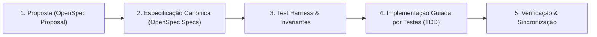

# 📐 Spec-Driven Development (SDD) com OpenSpec

Este documento apresenta a metodologia de **Spec-Driven Development (SDD)** aplicada no desenvolvimento do **Snake Battle Royale Multiplayer**, utilizando o padrão aberto **[OpenSpec](file:///home/douglas/Workspace/claude/snake-game/openspec/)**.

---

## 🎯 1. O que é Spec-Driven Development (SDD)?

O **Spec-Driven Development (SDD)** é uma metodologia de engenharia de software na qual **nenhuma linha de código de produção é escrita antes que as especificações formais do sistema sejam aprovadas e versionadas**.

Em contraste com abordagens tradicionais onde os testes ou a implementação acontecem sobre requisitos informais, o SDD estabelece contratos matemáticos, esquemas de dados estritos e máquinas de estados finitas como a **Única Fonte da Verdade (Single Source of Truth - SSOT)**.



---

## 🏗️ 2. Estrutura Canônica do OpenSpec no Projeto

A pasta `openspec/` organiza todas as regras e especificações do projeto:

```text
openspec/
├── config.yaml                     # Configurações globais do projeto e regras de compliance
├── specs/                          # Source of Truth do comportamento do sistema por domínio
│   ├── protocol/spec.md            # Esquemas JSON Schema e eventos WebSocket
│   ├── physics/spec.md             # Fórmulas de movimento, turn rate, turbo e colisões
│   ├── lifecycle/spec.md           # FSM do Jogador e da Arena
│   └── harness/spec.md             # Invariantes e contratos do Test Harness
└── changes/                        # Pacotes de mudanças ativas
    └── v1.0.0-viper/
        ├── proposal.md             # Justificativa, objetivos e histórias de usuário
        ├── design.md               # Decisões técnicas de arquitetura e diagramas
        ├── tasks.md                # Checklist de execução da DAG
        └── specs/                  # Especificações Delta em formato formal
```

---

## 📋 3. Estrutura de Requisitos: EARS & Gherkin (GIVEN / WHEN / THEN)

Todas as especificações no OpenSpec utilizam linguagem formal e cenários comportamentais reproduzíveis:

### Exemplo: Requisito de Colisão de Borda (`REQ-PHYS-001`)
- **EARS:** *WHEN the distance from the snake head to any arena boundary is less than or equal to $R_{\text{head}}$, the server SHALL immediately transition the snake state to `DEAD` and convert its mass into corpse pellets.*
- **Cenário Gherkin:**
  - **GIVEN** an active snake positioned at $(10.0, 500.0)$ with head radius $14.5\text{ px}$
  - **WHEN** the physics simulation steps forward by $\Delta t = 0.033\text{s}$
  - **THEN** the snake status becomes `DEAD` and a `PLAYER_DEATH` packet is dispatched.

---

## 🔄 4. O Fluxo de Trabalho com OpenSpec

1. **Propose (`openspec/changes/<id>/proposal.md`):** Formalização do problema, casos de uso e escopo.
2. **Design (`openspec/changes/<id>/design.md`):** Arquitetura detalhada, diagramas de sequência e algoritmos.
3. **Spec Delta (`openspec/changes/<id>/specs/*.delta.md`):** Adições e modificações nos esquemas de rede e física.
4. **Apply (TDD & DAG):** Execução das tarefas do `tasks.md` guiada pelo Test Harness.
5. **Verify & Sync:** Execução das suítes de testes determinísticos para garantir 100% de conformidade com a especificação.
