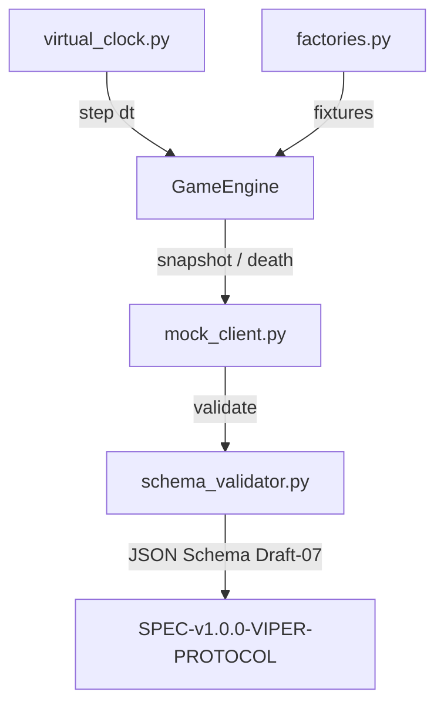
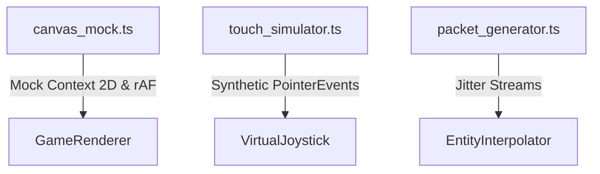

# 🧪 Arquitetura do Test Harness Determinístico

Este documento detalha o funcionamento e os princípios de design do **Test Harness** do **Snake Battle Royale Multiplayer**, garantindo testes assíncronos de alta velocidade, determinismo e execução sem temporizadores reais (`sleep`).

---

## ⚡ 1. Princípios Fundamentais

1. **Zero Real-Time Sleep:** Nenhuma suite de testes utiliza `time.sleep()`, `asyncio.sleep()` ou `setTimeout()`.
2. **Discretização por Relógio Virtual:** O tempo é controlado programaticamente através do avanço discreto de ticks ($\Delta t = 0.033\text{s}$).
3. **Sub-2s Total Execution:** Todas as suítes de teste (Backend + Frontend) executam em menos de 2 segundos.
4. **Validação Estrita de Schemas:** Todo payload de rede gerado é automaticamente confrontado contra os JSON Schemas formais da especificação OpenSpec.

---

## 🐍 2. Backend Test Harness (`server/tests/harness/`)



### Componentes:
- **`virtual_clock.py`:** Gerencia o tempo virtual do jogo, agendamento de callbacks e avanço discreto de frames (`clock.advance_ticks(30)`).
- **`schema_validator.py`:** Validador estrito baseado no pacote `jsonschema` que intercepta todas as mensagens trocadas (`JOIN`, `JOIN_ACK`, `INPUT`, `WORLD_SNAPSHOT`, `PLAYER_DEATH`, `RESPAWN_REQUEST`).
- **`factories.py`:** Utilitários para criação determinística de cobras, pellets de comida e snapshots de teste.
- **`mock_client.py`:** Cliente WebSocket simulado em memória capaz de despachar inputs sequenciais e validar pacotes recebidos do servidor.

---

## 🌐 3. Frontend Test Harness (`client/tests/harness/`)



### Componentes:
- **`canvas_mock.ts`:** Mock de `HTMLCanvasElement` e `CanvasRenderingContext2D` que grava o histórico de chamadas (`fillRect`, `arc`, `stroke`, `fill`, gradientes) e emula `requestAnimationFrame`.
- **`touch_simulator.ts`:** Emulador de `PointerEvents` e `TouchEvent` multi-touch (`pointerdown`, `pointermove`, `pointerup`) para validação do Joystick Virtual Flutuante e botão Turbo.
- **`packet_generator.ts`:** Gerador de fluxos contínuos de snapshots de rede com jitter configurável para testar a interpolação LERP.

---

## 🚀 4. Executando as Suítes de Teste

### Backend (Pytest):
```bash
uv run pytest
```
*Tempo típico de execução:* ~0.3s (28 testes).

### Frontend (Vitest):
```bash
cd client && npm test
```
*Tempo típico de execução:* ~0.4s (13 testes).
