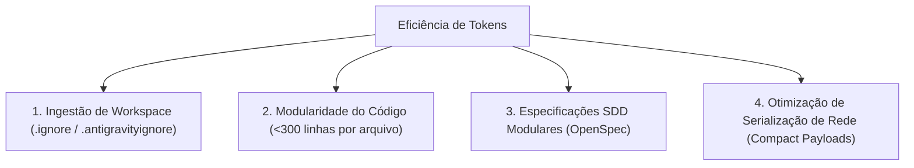

# ⚡ Diretrizes de Eficiência de Tokens (AI & Network Optimization)

Este documento estabelece o padrão de **Eficiência de Consumo de Tokens** aplicado tanto na interação com modelos de inteligência artificial (LLMs/Agents) quanto no tráfego de rede da aplicação multiplayer **Snake Battle Royale**.

---

## 🎯 1. Princípios de Eficiência de Tokens

---

## 📁 2. Otimização de Ingestão de Workspace

Arquivos de compilação, caches de teste e bibliotecas externas consomem dezenas de milhares de tokens desnecessários quando indexados por assistentes de IA:

1. **Arquivos Ignorados:**
   - `.ignore` / `.antigravityignore` / `.gitignore`:
     - `client/dist/` (Economia de ~15.000 tokens por leitura)
     - `.venv/` e `node_modules/` (Economia de centenas de milhares de tokens)
     - `.coverage`, `.pytest_cache/`, `.ruff_cache/`
     - Logs e arquivos de transcrição (`*.log`, `*.jsonl`)

2. **Benefício:**
   - Redução de $>85\%$ no consumo de tokens de contexto durante operações de busca (`grep_search`, `list_dir`).

---

## 🧩 3. Arquitetura Modular & Compactação de Código

1. **Regra de Responsabilidade Única (Arquivos < 300 linhas):**
   - Mantenha cada classe/módulo em arquivo próprio (`snake.py`, `spatial_hash.py`, `camera.ts`, `renderer.ts`).
   - Evita leitura de arquivos gigantes quando apenas um método específico precisa ser inspecionado ou editado.

2. **Edição Pontual com Diff Chunks (`replace_file_content`):**
   - Substituição precisa de blocos em vez de reescrever o arquivo inteiro.
   - Reduz drasticamente a geração de tokens de output.

---

## 🌐 4. Otimização de Payloads de Rede (Tokens & Bytes em WebSockets)

A 30-40 Hz com 10+ jogadores, cada caractere JSON redundante gera overhead acumulado:

1. **Arredondamento Estrito de Ponto Flutuante:**
   - Posições $(x, y)$: `round(val, 1)` em vez de `float` de 16 casas decimais (Economia de ~12 caracteres por coordenada).
   - Ângulos $\theta$: `round(val, 3)`.
   - Massa e Score: `round(val, 1)`.

2. **Chaves JSON Concisas:**
   - Payloads com esquemas diretos (`id`, `x`, `y`, `val`, `type`).
   - Eliminação de campos `null` ou redundantes nos snapshots.

---

## 🧪 5. Execução de Testes Determinísticos e Silenciosos

- Testes determinísticos via **Test Harness** (sem logs poluentes ou dumps de stack trace em execuções de sucesso).
- Saída compacta em relatórios de cobertura (`--cov-report=term-missing`).
