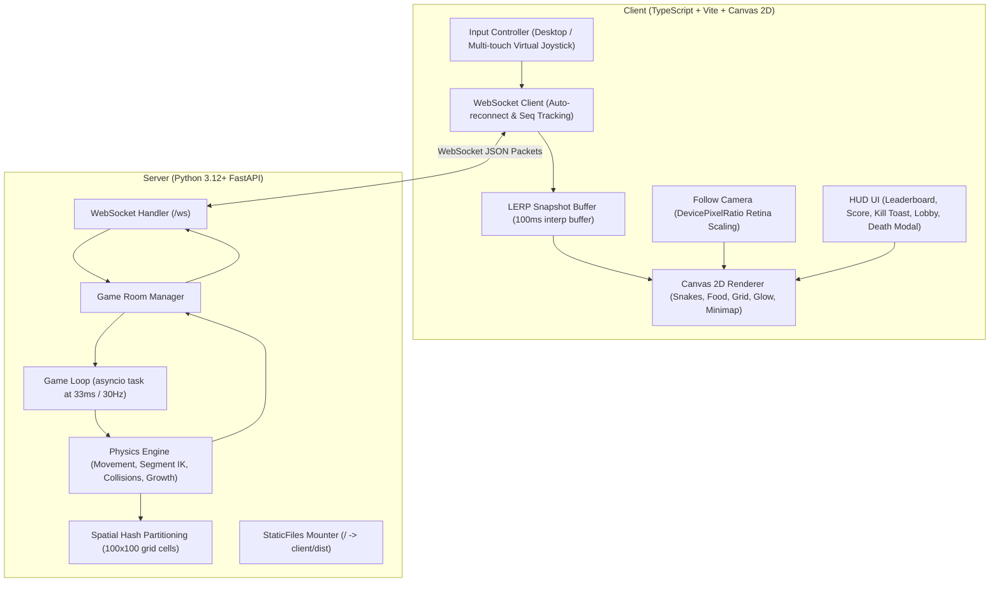
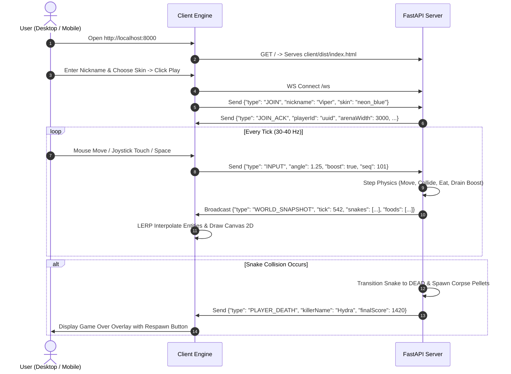

# OpenSpec Design: v1.0.0-VIPER — Technical Architecture & Implementation
**Change ID:** `v1.0.0-viper`  
**Status:** `APPROVED`  

---

## 1. System Architecture

---

## 2. Key Technical Decisions & Algorithms

### 2.1 Spatial Hash Partitioning for Collision Detection
- **Cell Size:** $100 \times 100\text{ px}$.
- Every snake body segment is registered into the hash map `grid[cell_key] = [segments...]`.
- Head collision check queries only neighboring $3 \times 3$ cells instead of comparing against every segment in the arena, reducing complexity from $O(N \cdot L)$ to $O(k)$ where $k \ll N \cdot L$.

### 2.2 Inverse Kinematic Segment Following
When the snake moves by distance $d = v \cdot \Delta t$:
1. Head advances to $H' = H + (\cos\theta, \sin\theta) \cdot d$.
2. Segment $S_0$ adjusts position towards $H'$ such that $\|H' - S_0\| = D_{\text{segment}}$.
3. Segment $S_i$ adjusts position towards $S_{i-1}$ such that $\|S_{i-1} - S_i\| = D_{\text{segment}}$.
4. Body array maintains $L(M) = 10 + \lfloor M \times 1.5 \rfloor$ segments.

### 2.3 Client-Side LERP & Snapshot Buffering
- Client maintains a ring buffer of the last 10 snapshots with timestamps.
- Render time is set to $T_{\text{render}} = T_{\text{now}} - 100\text{ms}$ (interpolation delay).
- For two surrounding snapshots $S_1$ (time $t_1$) and $S_2$ (time $t_2$), interpolation factor is:
  $$\alpha = \frac{T_{\text{render}} - t_1}{t_2 - t_1}, \quad \alpha \in [0, 1]$$
- Snake head position is computed as:
  $$P_{\text{interp}} = P_1 \cdot (1 - \alpha) + P_2 \cdot \alpha$$
- Head angle is interpolated using shortest angular distance (slerp/lerp with angle wrapping).

### 2.4 Floating Virtual Joystick (Mobile/Tablet)
- `pointerdown` on touchscreen initiates the joystick center $(C_x, C_y)$ at touch coordinate.
- `pointermove` calculates offset vector $\vec{V} = (T_x - C_x, T_y - C_y)$ clamped to radius $R_{\text{max}} = 60\text{ px}$.
- Calculated angle $\theta = \text{atan2}(V_y, V_x)$ is dispatched to the input stream.
- Dedicated touch zone for Turbo button with distinct `pointerId` prevents multi-touch conflicts.

---

## 3. Data Flow Diagram

