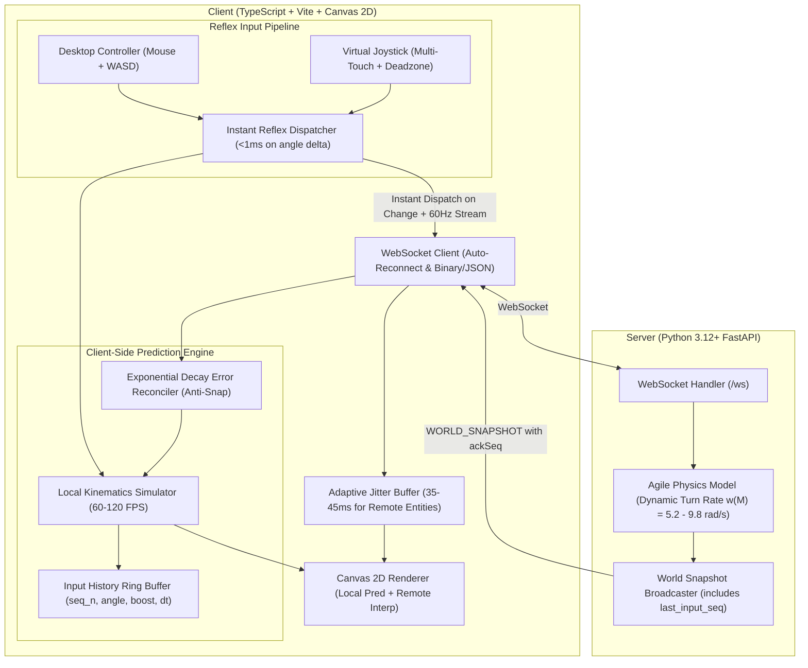

# OpenSpec Design: v1.1.0-REFLEX — Technical Architecture & Implementation
**Change ID:** `v1.1.0-reflex`  
**Status:** `APPROVED`  

---

## 1. System Architecture

---

## 2. Key Technical Innovations

### 2.1 Dynamic Agile Turn Model $\omega(M)$
To achieve high precision while preventing infinite agility on massive snakes, the turn rate is computed continuously:
$$\omega(M) = 5.2 + \frac{4.6}{1 + 0.015 \cdot \max(0, M - 10)}$$
- **Spawn Mass ($M=10$):** $\omega = 9.8\text{ rad/s}$ ($561.5^\circ/\text{s}$). $90^\circ$ turn takes $0.160\text{s}$ ($160\text{ms}$).
- **Medium Mass ($M=50$):** $\omega \approx 8.08\text{ rad/s}$ ($463^\circ/\text{s}$).
- **Large Mass ($M=100$):** $\omega \approx 6.95\text{ rad/s}$ ($398^\circ/\text{s}$).
- **Titan Mass ($M=500$):** $\omega \to 5.2\text{ rad/s}$ ($298^\circ/\text{s}$).

### 2.2 Client-Side Prediction (CSP) & Reconciliation
- When the local player inputs a heading $\theta$, the `LocalPredictor` simulates forward motion immediately at the client's display frame rate ($60-120\text{ FPS}$) without waiting for server network turnaround.
- Each input frame is pushed to an unacknowledged history buffer with sequence index `seq`.
- When `WORLD_SNAPSHOT` arrives acknowledging up to `ack_seq`:
  1. Older entries $\le \text{ack\_seq}$ are purged from history buffer.
  2. The server position is compared against the predicted state at `ack_seq`.
  3. If discrepancy $\|\vec{\epsilon}\| > 0.5\text{px}$, error vector $\vec{\epsilon}$ is smoothed out over subsequent frames using exponential decay $\vec{\epsilon}(t + \Delta t) = \vec{\epsilon}(t) \cdot e^{-\lambda \Delta t}$ with $\lambda = 15.0$, completely avoiding visual pops or snaps.

### 2.3 Instant Reflex Input Dispatcher
- Standard periodic polling ($33.3\text{ms}$) is replaced with an event-driven immediate dispatch:
  - On `keydown` / `keyup` (WASD / Space): Immediate dispatch ($\approx 0.1\text{ms}$).
  - On `mousemove` / `pointermove`: Immediate dispatch if angular difference $|\theta_{\text{new}} - \theta_{\text{prev}}| \ge 0.015\text{ rad}$ ($\approx 0.86^\circ$).
  - Continuous periodic heartbeat at $60\text{Hz}$ guarantees state synchrony during stationary holds.

### 2.4 Adaptive Jitter Buffer (35-45ms)
- Static $100\text{ms}$ delay in `interpolator.ts` is replaced by an adaptive delay:
  $$\tau_{\text{interp}} = \max(35.0, \min(60.0, 1.2 \times \overline{\Delta t}_{\text{snapshot}} + 3 \times \sigma_{\text{jitter}}))$$
  Under stable local connection ($\overline{\Delta t} = 33.3\text{ms}, \sigma \approx 1\text{ms}$), $\tau_{\text{interp}} \approx 43\text{ms}$, reducing remote rendering lag by $>55\%$.
