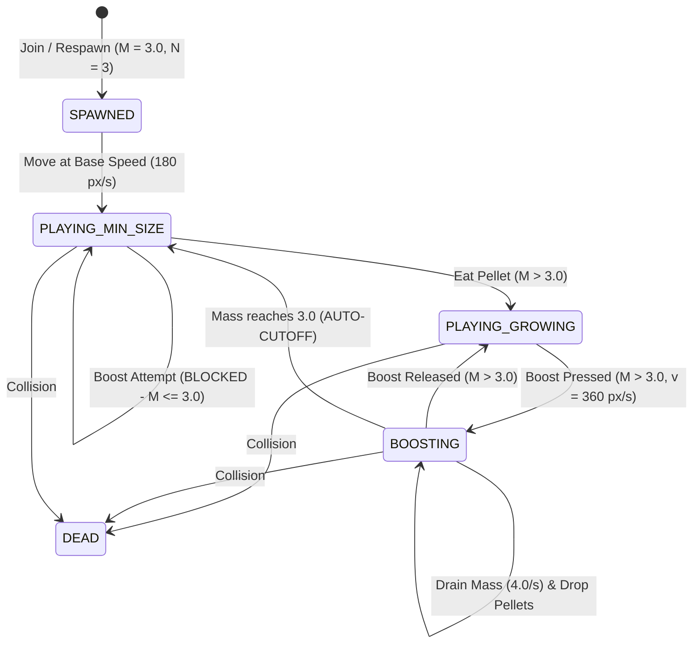
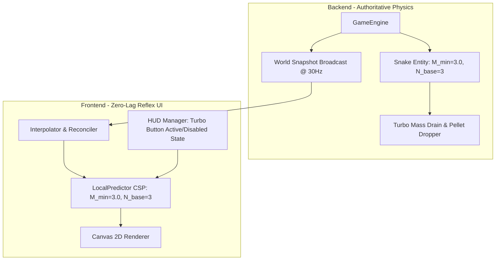

# OpenSpec Design: v1.2.0-MICRO-SNAKE — Technical Architecture & Mathematical Models
**Change ID:** `v1.2.0-micro-snake`  
**Status:** `PROPOSED`  

---

## 1. Mathematical Formulation

### 1.1 Segment Count & Mass Relationship
Let $M \ge 3.0$ be the current mass of the snake.
- Minimum mass: $M_{\min} = 3.0$
- Base segment count: $N_{\text{base}} = 3$
- Growth factor: $k_{\text{growth}} = 1.5\text{ segments/mass}$

The target segment count $N_{\text{segments}}(M)$ is given by:
$$N_{\text{segments}}(M) = N_{\text{base}} + \lfloor \max(0.0, M - M_{\min}) \times k_{\text{growth}} \rfloor$$

At initial spawn ($M = 3.0$):
$$N_{\text{segments}}(3.0) = 3 + \lfloor 0.0 \times 1.5 \rfloor = 3$$

### 1.2 Speed & Turbo Gating
Let $I_{\text{boost}} \in \{0, 1\}$ be the player's boost input flag.
The effective boost state $B(t)$ and velocity $v(t)$ are:
$$B(t) = I_{\text{boost}} \land (M(t) > M_{\min})$$

$$v(t) = \begin{cases} 
360.0\text{ px/s} & \text{if } B(t) = 1 \\
180.0\text{ px/s} & \text{if } B(t) = 0
\end{cases}$$

### 1.3 Mass Depletion Dynamics
While $B(t) = 1$:
$$\frac{dM}{dt} = -R_{\text{drain}}, \quad R_{\text{drain}} = 4.0\text{ mass/s}$$
$$M(t + \Delta t) = \max(M_{\min}, M(t) - R_{\text{drain}} \Delta t)$$

When $M(t + \Delta t) = M_{\min} = 3.0$, $B(t + \Delta t)$ transitions to $0$.

---

## 2. State Machine Transition Diagram

---

## 3. Component Architecture & Synchronization

---

## 4. UI/UX Interaction Design
1. **Mobile Turbo Button (`.mobile-turbo-btn`):**
   - When $M \le 3.0$: `.disabled` class added -> visual opacity $0.4$, grayscale, no press animation, pointer-events pass-through / inert.
   - When $M > 3.0$: `.disabled` removed -> vibrant cyan/blue glow, interactive touch response.
2. **Desktop Controls Hint:**
   - HUD text: `Space (Turbo - Requires Mass > 3.0)` / `📱 Tap Turbo (Requires Mass > 3.0)`.
