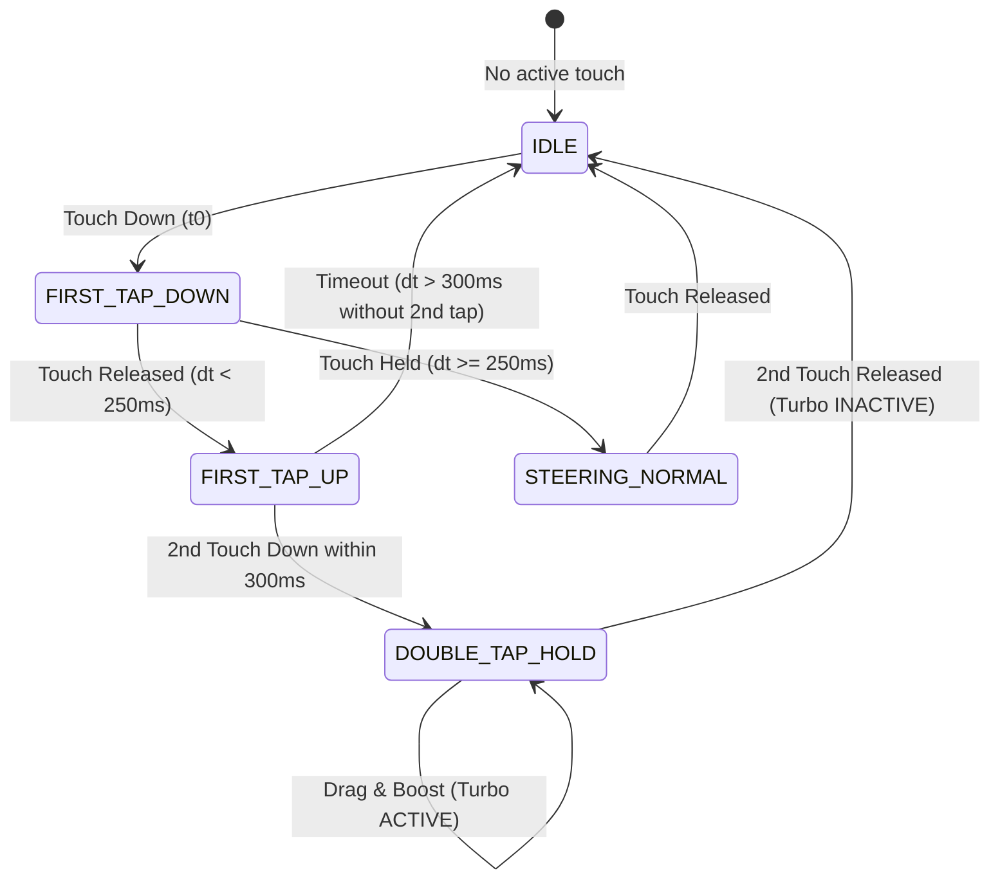

# OpenSpec Design: v1.3.0-COMBAT-POLISH — Architecture & Mathematical Formulations
**Change ID:** `v1.3.0-combat-polish`  
**Status:** `RATIFIED / COMPLETED`  

---

## 1. Double-Tap & Hold Gesture State Machine



---

## 2. Interpolation Clock Synchronization & Anti-Jitter Formulation

### 2.1 The Epoch Mismatch Bug & Fix
Previously:
$$\text{renderTime} = t_{\text{performance.now()}} - \Delta_{\text{delay}} \ll t_{\text{snapshot.timestamp (Unix Epoch)}}$$
Result: $\alpha = 0$ permanently, snapping only to oldest frame.

**New Formulation:**
Each snapshot $S_k$ is tagged with its local arrival timestamp $t_{\text{clientArrival}, k} = \text{performance.now()}$.
$$\text{renderTime}(t) = t - \Delta_{\text{interpolationDelay}}$$
Framing snapshots $S_0, S_1$ are selected such that:
$$t_{\text{clientArrival}, 0} \le \text{renderTime}(t) \le t_{\text{clientArrival}, 1}$$
$$\alpha(t) = \frac{\text{renderTime}(t) - t_{\text{clientArrival}, 0}}{t_{\text{clientArrival}, 1} - t_{\text{clientArrival}, 0}}, \quad \alpha \in [0, 1]$$
Both head and each body segment are smoothly interpolated along continuous Hermite/LERP arcs.

---

## 3. Pure-Contact Collision Mechanics

### 3.1 Strict Head-to-Opponent Collision Equation
Let $H_A$ be Snake $A$'s head and $S_{B, i}$ be segment $i$ of opponent Snake $B$ ($B \neq A$):
$$\text{Collision Condition: } \|H_A - S_{B, i}\| \le R_{\text{head}}(M_A) + R_{\text{body}}(M_B) - 2.0\text{ px}$$

- **No Self-Collision:** For all $i \in [0, L_A]$, $\|H_A - S_{A, i}\|$ is ignored. A snake never dies from touching its own body.
- **Arena Boundary Contact:**
$$\text{Boundary Death: } x_{H} \le R_{\text{head}} \lor x_{H} \ge W - R_{\text{head}} \lor y_{H} \le R_{\text{head}} \lor y_{H} \ge H - R_{\text{head}}$$

---

## 4. Visual Palette: 12+ Mixed & Patterned Skins

```typescript
export const SKINS: Record<string, SkinPalette> = {
  neon_cyan:      { head: '#00f0ff', bodyStart: '#00d2ff', bodyEnd: '#0055ff', pattern: 'alternate', glow: '#00f0ff' },
  cyber_magenta:  { head: '#ff007f', bodyStart: '#ff007f', bodyEnd: '#8b00ff', pattern: 'alternate', glow: '#ff007f' },
  toxic_lime:     { head: '#39ff14', bodyStart: '#39ff14', bodyEnd: '#00aa55', pattern: 'alternate', glow: '#39ff14' },
  solar_flare:    { head: '#ffd700', bodyStart: '#ffaa00', bodyEnd: '#ff2200', pattern: 'gradient',  glow: '#ffd700' },
  hyper_rainbow:  { head: '#ffffff', bodyStart: '#ff0055', bodyEnd: '#00ffff', pattern: 'rainbow',   glow: '#ffffff' },
  galaxy_void:    { head: '#9d00ff', bodyStart: '#4a00e0', bodyEnd: '#000033', pattern: 'alternate', glow: '#9d00ff' },
  sunset_vapor:   { head: '#ff6b6b', bodyStart: '#ffa07a', bodyEnd: '#9b59b6', pattern: 'alternate', glow: '#ff6b6b' },
  lava_magma:     { head: '#ff3300', bodyStart: '#ff5500', bodyEnd: '#220000', pattern: 'alternate', glow: '#ff3300' },
  ice_frost:      { head: '#ffffff', bodyStart: '#a8ffeb', bodyEnd: '#00b4d8', pattern: 'alternate', glow: '#a8ffeb' },
  toxic_hazard:   { head: '#ffcc00', bodyStart: '#ffcc00', bodyEnd: '#111111', pattern: 'zebra',     glow: '#ffcc00' },
  bubblegum:      { head: '#ff99c8', bodyStart: '#ff99c8', bodyEnd: '#a9def9', pattern: 'alternate', glow: '#ff99c8' },
  matrix_code:    { head: '#00ff66', bodyStart: '#00ff66', bodyEnd: '#002200', pattern: 'alternate', glow: '#00ff66' }
};
```
