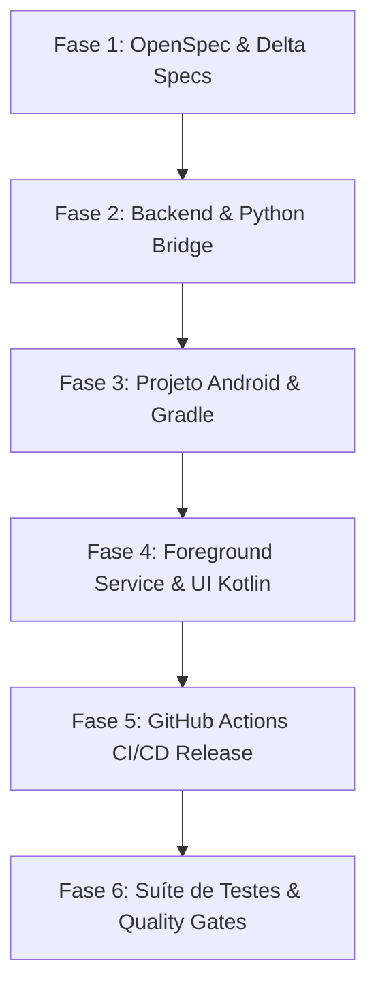

# OpenSpec Tasks: v1.5.0-ANDROID-HOST Implementation Checklist

**Change ID:** `v1.5.0-android-host`  
**Status:** `COMPLETED`  
**Branch:** `feature/android-server-host`  

---

## 🧭 Protocolo de Continuidade e Recuperação de Erros (Resume & Recovery)

Caso ocorra qualquer erro ou interrupção durante a execução, utilize este checklist estruturado para retomar exatamente de onde parou:

1. **Inspecionar o Estado Atual**:
   ```bash
   git status
   ```
2. **Verificar a Última Tarefa Concluída**:
   - Cada tarefa abaixo possui uma caixa de seleção `[ ]` ou `[x]` e um **Comando de Verificação**.
   - Identifique a primeira tarefa desmarcada `[ ]` dentro da fase corrente.
3. **Executar a Verificação da Fase Anterior**:
   - Rode o comando de verificação da fase anterior para garantir integridade.
4. **Retomar a Execução**:
   - Aplique as alterações do arquivo alvo especificado na tarefa.
   - Execute o comando de validação correspondente.
   - Marque a tarefa como concluída `[x]` e passe para a próxima.

---

## 📋 DAG de Tarefas (Graph Engineering)



---

## Phase 1: OpenSpec & Especificações Formais
- [x] **Task 1.1**: Criar especificação canônica `openspec/specs/android/spec.md`.
  - *Arquivos*: `openspec/specs/android/spec.md`
  - *Verificação*: `npm run spec:validate`
- [x] **Task 1.2**: Criar artefatos da mudança `openspec/changes/v1.5.0-android-host/` (`proposal.md`, `design.md`, `tasks.md`).
  - *Arquivos*: `openspec/changes/v1.5.0-android-host/*`
  - *Verificação*: `openspec doctor`

---

## Phase 2: Ajustes no Backend Python & Bridge Android
- [x] **Task 2.1**: Atualizar `server/app/main.py` para suportar resolução dinâmica de `static_dir` via variável de ambiente `SNAKE_STATIC_DIR` ou fallback de assets do Android.
  - *Arquivos*: `server/app/main.py`
  - *Verificação*: `uv run pytest server/tests/test_integration.py`
- [x] **Task 2.2**: Atualizar `server/app/network_utils.py` com rotinas robustas de detecção de IP em dispositivos móveis e testes unitários.
  - *Arquivos*: `server/app/network_utils.py`, `server/tests/test_network_utils.py`
  - *Verificação*: `uv run pytest server/tests/test_network_utils.py`
- [x] **Task 2.3**: Criar módulo de entrada Python para o Android `android/app/src/main/python/android_entry.py` com ciclo de vida assíncrono do Uvicorn.
  - *Arquivos*: `android/app/src/main/python/android_entry.py`
  - *Verificação*: `uv run ruff check android/app/src/main/python`

---

## Phase 3: Estrutura do Projeto Android & Gradle Build
- [x] **Task 3.1**: Configurar arquivos raiz do Gradle (`android/settings.gradle.kts`, `android/build.gradle.kts`, `android/gradle.properties`).
  - *Arquivos*: `android/settings.gradle.kts`, `android/build.gradle.kts`, `android/gradle.properties`
  - *Verificação*: Sintaxe Kotlin DSL e repositórios Chaquopy
- [x] **Task 3.2**: Configurar módulo do app (`android/app/build.gradle.kts`) com Chaquopy, dependências Python (`fastapi`, `uvicorn`, `websockets`, `pydantic`, `jsonschema`), AndroidX e tarefa de sincronização de assets web.
  - *Arquivos*: `android/app/build.gradle.kts`, `android/app/proguard-rules.pro`
  - *Verificação*: Configuração de dependências e ABI filters (arm64-v8a, armeabi-v7a, x86_64)

---

## Phase 4: Foreground Service, UI Nativa & WebView (Kotlin)
- [x] **Task 4.1**: Criar `android/app/src/main/AndroidManifest.xml` com declaração de permissões (`INTERNET`, `ACCESS_WIFI_STATE`, `FOREGROUND_SERVICE`, `WAKE_LOCK`, `POST_NOTIFICATIONS`) e declaração das Activities e Service.
  - *Arquivos*: `android/app/src/main/AndroidManifest.xml`
  - *Verificação*: Validação de sintaxe XML e manifesto
- [x] **Task 4.2**: Implementar `NetworkHelper.kt` (descoberta de IP local Wi-Fi) e `QRCodeHelper.kt` (geração de QR Code bitmap).
  - *Arquivos*: `android/app/src/main/java/com/snakeroyale/host/NetworkHelper.kt`, `android/app/src/main/java/com/snakeroyale/host/QRCodeHelper.kt`
  - *Verificação*: Validação de código Kotlin e tratamento de exceções
- [x] **Task 4.3**: Implementar `ServerForegroundService.kt` com notificação persistente, ações de controle, `WakeLock`, `WifiLock` e inicialização do Python ASGI thread.
  - *Arquivos*: `android/app/src/main/java/com/snakeroyale/host/ServerForegroundService.kt`
  - *Verificação*: Validação de ciclo de vida do Service e NotificationCompat
- [x] **Task 4.4**: Implementar `MainActivity.kt` (Dashboard com status do servidor, IP LAN, QR Code, botões "Jogar no Navegador", "Jogar no App", "Compartilhar") e layouts XML (`activity_main.xml`, cores, strings, drawables).
  - *Arquivos*: `android/app/src/main/java/com/snakeroyale/host/MainActivity.kt`, `android/app/src/main/res/*`
  - *Verificação*: Layout Material 3 e validação de referências de IDs
- [x] **Task 4.5**: Implementar `GameWebViewActivity.kt` com WebView de alta performance para jogabilidade interna.
  - *Arquivos*: `android/app/src/main/java/com/snakeroyale/host/GameWebViewActivity.kt`, `android/app/src/main/res/layout/activity_game_webview.xml`
  - *Verificação*: Configurações de WebSettings (hardware acceleration, touch, DOM storage)

---

## Phase 5: Pipeline de CI/CD para GitHub Release & Scripts
- [x] **Task 5.1**: Criar workflow `.github/workflows/release.yml` para compilar o frontend, rodar testes, compilar o APK Android e fazer upload automático para os Assets da Release no GitHub.
  - *Arquivos*: `.github/workflows/release.yml`
  - *Verificação*: Validação de sintaxe YAML e jobs do GitHub Actions
- [x] **Task 5.2**: Adicionar scripts de automação no `package.json` (`android:sync-client`, `android:build`).
  - *Arquivos*: `package.json`
  - *Verificação*: `npm run android:sync-client`

---

## Phase 6: Suíte de Testes, Linters & Quality Gates
- [x] **Task 6.1**: Criar testes unitários para o bridge e integração móvel em `server/tests/test_android_bridge.py`.
  - *Arquivos*: `server/tests/test_android_bridge.py`
  - *Verificação*: `uv run pytest server/tests/test_android_bridge.py`
- [x] **Task 6.2**: Executar validação global de qualidade (100% pass nos linters, type checks, e cobertura >= 80%).
  - *Verificação*: `npm test && npm run lint`

