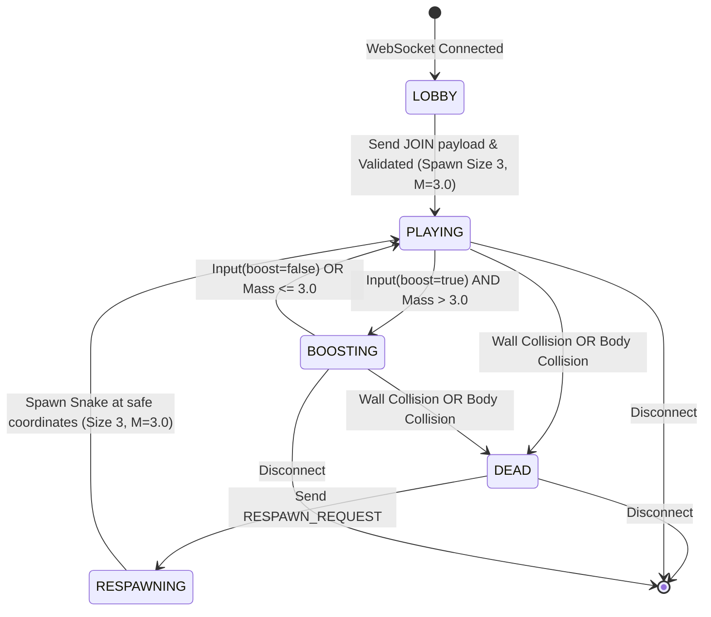
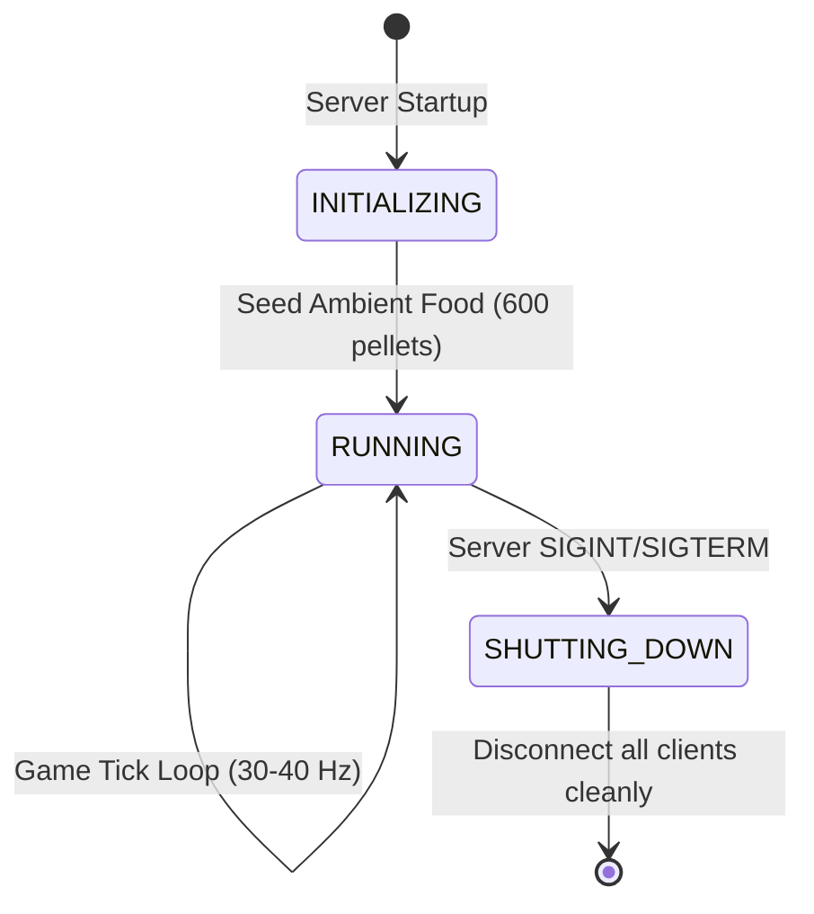

# OpenSpec: Player & Arena Lifecycle Specification
**Domain:** `lifecycle`  
**Version:** `1.2.0-MICRO-SNAKE`  
**Status:** `ACTIVE`  

---

## 1. Player Finite State Machine (FSM)

### State Definitions

| State | Description | Invariants & Allowed Actions |
| :--- | :--- | :--- |
| `LOBBY` | Client is connected to WebSocket but has not joined the match. | Client can send `JOIN`. No snake entity in the physics world. |
| `PLAYING` | Snake is actively navigating the arena at base speed ($v_{\text{base}}$). | Receives inputs (`angle`, `boost`), consumes food, collides with walls/bodies. |
| `BOOSTING` | Snake travels at $v_{\text{turbo}}$, shedding mass and spawning boost pellets. | Mass is decremented per tick. Auto-transitions to `PLAYING` if mass drops to 3.0 (minimum size 3). |
| `DEAD` | Snake was eliminated. | Snake body is converted to corpse pellets. Receives `PLAYER_DEATH` packet. Allowed to send `RESPAWN_REQUEST`. |
| `RESPAWNING` | Transition state where safe spawn coordinates are computed. | Ensures newly spawned snake does not instantly collide with existing snakes. Transitions to `PLAYING`. |

---

## 2. Arena / Room Lifecycle

### Arena Invariants
1. **Target Food Density:** If active food count falls below 500, the arena spawns ambient pellets uniformly across non-occupied sectors until count reaches 600.
2. **Safe Respawn Calculation:** A safe spawn point $(x, y)$ must maintain a minimum clear distance of $150\text{ px}$ from any active snake head or body segment.
3. **Leaderboard Sorting:** At every tick, leaderboard is sorted descending by `score = floor(mass * 10)`.

---

## 3. Scenarios (GIVEN / WHEN / THEN)

### Scenario: Transition to Boosting and Auto-Revert on Low Mass
- **GIVEN** a player in state `PLAYING` with mass $M = 15.1$
- **WHEN** client sends input with `boost: true`
- **THEN** state transitions to `BOOSTING`, speed increases to $v_{\text{turbo}}$
- **AND WHEN** mass drops to $14.9$
- **THEN** state automatically reverts to `PLAYING` at $v_{\text{base}}$.

### Scenario: Safe Respawn after Death
- **GIVEN** a player in `DEAD` state
- **WHEN** client sends `RESPAWN_REQUEST`
- **THEN** engine finds a location with distance $> 150\text{ px}$ from all snakes and resets player to `PLAYING` with initial mass $M_0 = 10$.
